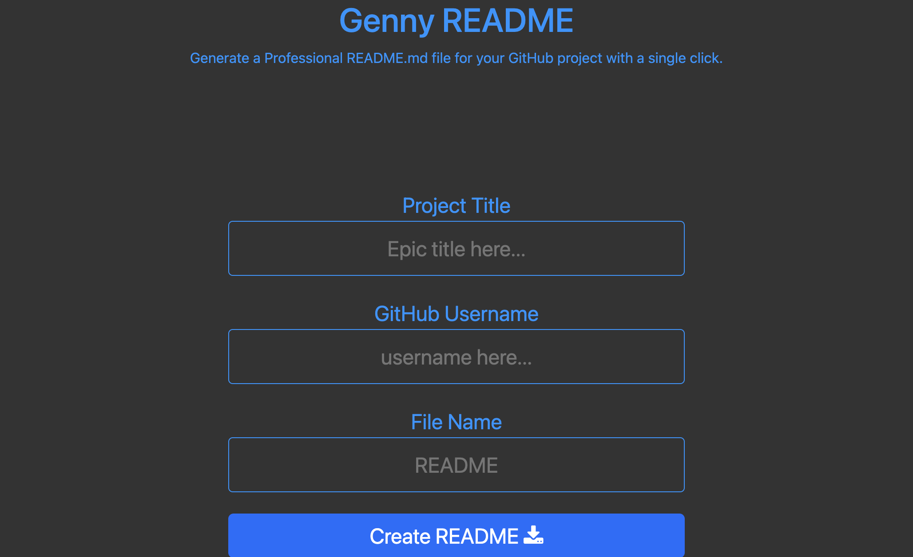

# GennyREADME

## Description

Genny README is a user-friendly web application that allows you to quickly and easily generate a professional README file for your Github projects. With just a few clicks, you can create a customized README file that includes a project description, installation instructions, usage information, credits, and more. Simply input your project title, Github username, and file name, and Genny README does the rest. Save time and ensure your projects have a polished and informative README file with Genny README.

## Table of Contents

- [Installation](#installation)
- [Usage](#usage)
- [Credits](#credits)
- [License](#license)

## Installation

- [Project repo](https://github.com/shaynefw/GennyREADME)
- [Project deployed link](https://shaynefw.github.io/GennyREADME/)
- [Project Video Demo]()

## Usage

1. Enter your project title in the "Project Title" input field.
2. Enter your Github username in the "GitHub Username" input field.
3. Enter the name you want for your README file in the "File Name" input field.
4. Click the "Create README" button.
5. Check your downloads folder or the location you specified for the downloaded file.
6. Open the generated README file in a text editor to review and customize it according to your project's needs.

## Credits

UofT bootcamp, classmates, prof, instructors, google

## License

MIT License

Copyright (c) 2023 Shayne Whayne

Permission is hereby granted, free of charge, to any person obtaining a copy
of this software and associated documentation files (the "Software"), to deal
in the Software without restriction, including without limitation the rights
to use, copy, modify, merge, publish, distribute, sublicense, and/or sell
copies of the Software, and to permit persons to whom the Software is
furnished to do so, subject to the following conditions:

The above copyright notice and this permission notice shall be included in all
copies or substantial portions of the Software.

THE SOFTWARE IS PROVIDED "AS IS", WITHOUT WARRANTY OF ANY KIND, EXPRESS OR
IMPLIED, INCLUDING BUT NOT LIMITED TO THE WARRANTIES OF MERCHANTABILITY,
FITNESS FOR A PARTICULAR PURPOSE AND NONINFRINGEMENT. IN NO EVENT SHALL THE
AUTHORS OR COPYRIGHT HOLDERS BE LIABLE FOR ANY CLAIM, DAMAGES OR OTHER
LIABILITY, WHETHER IN AN ACTION OF CONTRACT, TORT OR OTHERWISE, ARISING FROM,
OUT OF OR IN CONNECTION WITH THE SOFTWARE OR THE USE OR OTHER DEALINGS IN THE
SOFTWARE.

## Badges

## Features

Easy-to-use form: The website has a simple and user-friendly form that makes it easy to input your project information.

Automated README file generation: With the click of a button, Genny README generates a README file for you based on the input you provided, saving you time and effort.

Customizable README template: The README template generated by Genny README includes various sections, such as installation instructions, usage information, credits, and license, that you can customize to your project's needs.

Alert system: The website has an alert system that notifies you when you enter a file name that already includes the ".md" extension.

Immediate file download: After generating the README file, Genny README downloads it automatically to your device, so you can easily access it and add it to your Github repository.

Responsive design: The website is designed to be responsive, which means it looks and functions well on different screen sizes and devices.

Bootstrap and Font Awesome libraries: The website uses the Bootstrap and Font Awesome libraries to improve the design and functionality of the website.

## How to Contribute

## Questions

If you have any questions you can reach me by email at through my [github profile](https://github.com/shaynefw).
  